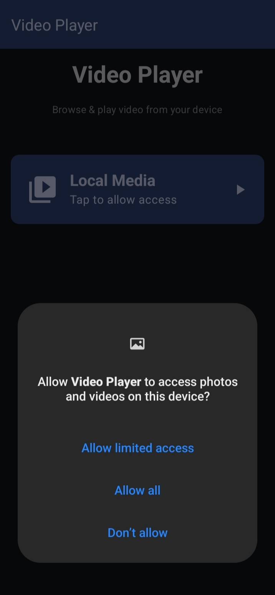
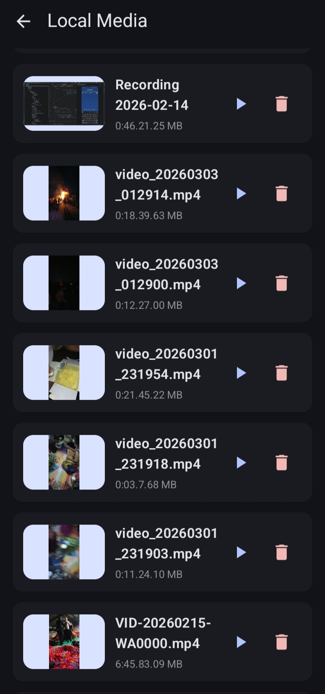

# Video Player App
A simple Android Video Player application built using Kotlin and Jetpack Compose. The app allows users to play local videos with smooth controls and a responsive UI.

# Features
- Play local videos
- Play / Pause 
- Clean UI with Jetpack Compose
- Smooth playback experience

# Tech Stack
- Kotlin
- Jetpack Compose
- ExoPlayer / Media3

## Screenshots

